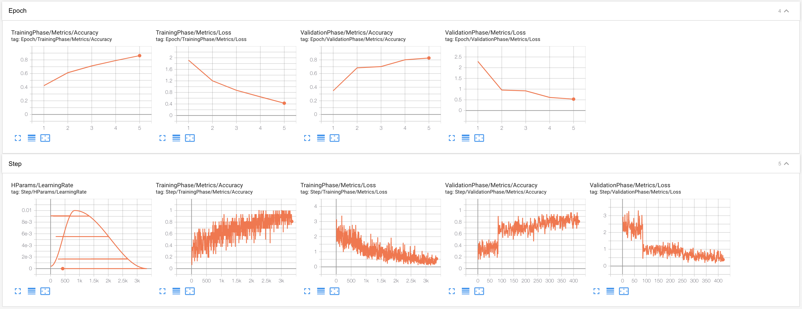

# How to log to TensorBoard

TensorBoard is a format and viewer for logs of model training and can be used to inspect and compare the results of training runs. We can log step and epoch metrics, hyperparameters and even visualizations to TensorBoard using FluxTraining.jl's logging callbacks.

## Generating logs

To use logging callbacks, we need to pass a log backend, here [`TensorBoardBackend`](#). This design allows flexibly supporting other logging backends like Weights and Biases or neptune.ai in the future.

{cell=main}
```julia
using FastAI

dir = mktempdir()
backend = TensorBoardBackend(dir)
```

Then we create callbacks for logging metrics and hyperparameters to that backend:

{cell=main}
```julia
metricscb = LogMetrics(backend)
hparamscb = LogHyperParams(backend)
```

Like any other callbacks, these can then be passed to a `Learner` along with other callbacks and we can start training. By using the [`Metrics`](#) callback we can log metrics other than the loss.

```julia

callbacks = [
    metricscb,
    hparamscb,
    ToGPU(),
    Metrics(accuracy)
]

data = ...
method = ...
learner = methodlearner(method, data, Models.xresnet18(), callbacks...)
fitonecycle!(learner, 5)
```

## Inspecting logs

To inspect the logs you will have to install the `tensorboard` command-line using `pip` (you can access the command-line in the Julia REPL by pressing `;`).

```
shell> pip install tensorboard
```

After this one-time installation, you can run it by pointing it to the log directory created above:

```
shell> tensorboard --logdir $dir
```

This should give you an URL that you can open in a browser which should look like this:



Note that you can also open TensorBoard and it will update as the training progresses.